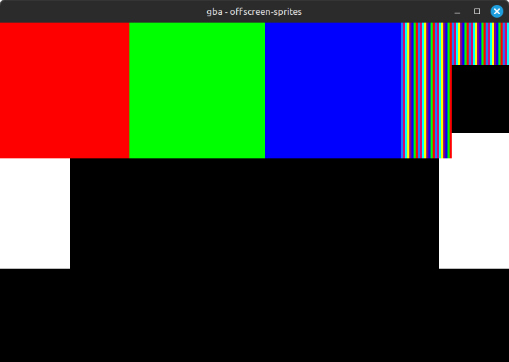

## offscreen-sprites

Test ROM for checking sprite-per-scanline cycle limits when some sprites are partially or fully offscreen.

This test populates OAM with the following sprites, in order:
* 100x 128x128 affine double size sprites at Y=20, fully horizontally offscreen (X=240)
* 2x 128x128 affine double size sprites at Y=20, partially horizontally offscreen to the right (X=173)
* 2x 128x128 affine double size sprites at Y=20, partially horizontally offscreen to the left (X=449)
* 4x 64x64 non-affine sprites at Y=0 at X coordinates 509, 61, 125, 191
* Remaining sprites disabled

The affine double size sprites are all solid white. The affine transformation is set to the identity matrix so the 128x128 sprites each display as a 64x64 square in the center with a 32-pixel transparent border on each side.

The non-affine sprites are 1. solid red, 2. solid green, 3. solid blue, and 4. striped colors.

Expected output (this was captured in an emulator but it matches actual hardware):

